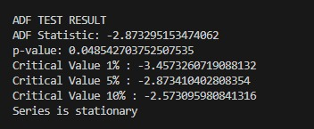
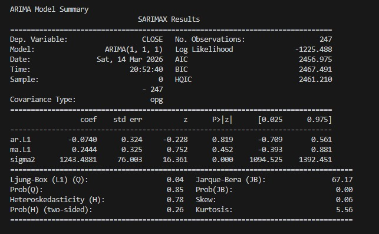
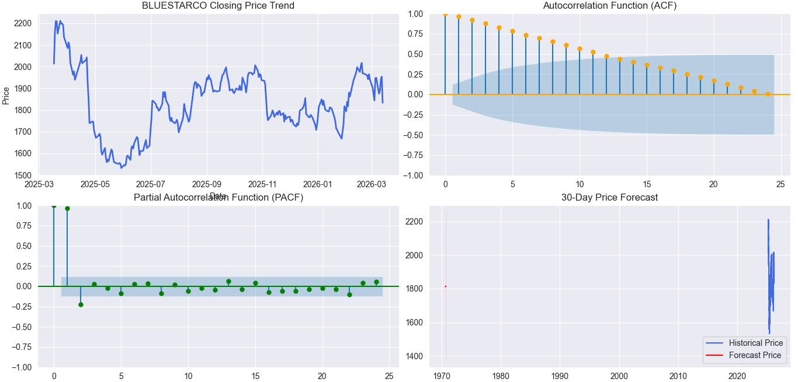
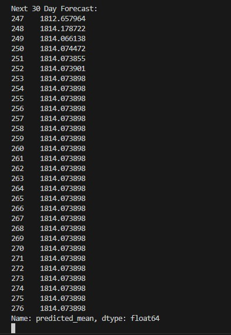
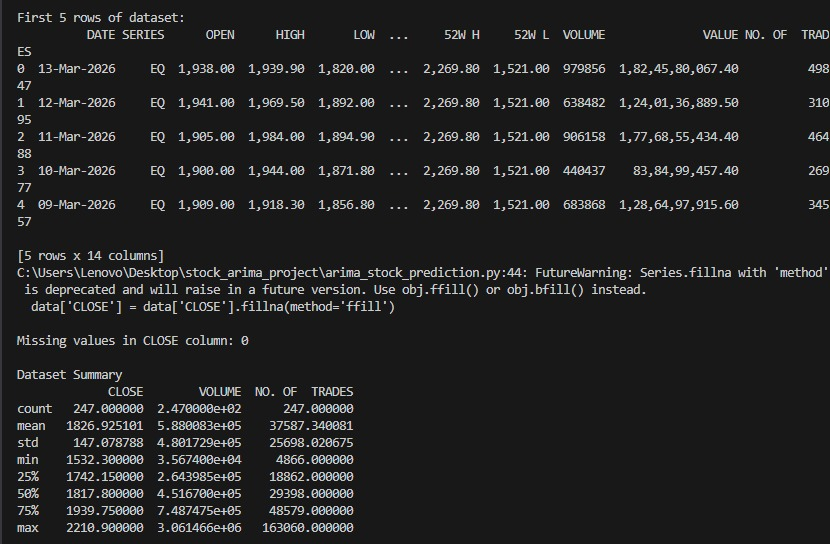

# NSE Stock Price Forecast using ARIMA

## Project Overview

This project performs time series analysis and forecasting on the stock price of **BLUESTARCO**, a publicly traded company listed on the National Stock Exchange (NSE).

The objective of this project is to analyze historical stock price data and apply the **ARIMA (AutoRegressive Integrated Moving Average)** model to predict future stock prices.

The project includes data preprocessing, stationarity testing, ACF and PACF analysis, ARIMA model training, and forecasting of the next 30 days of closing prices.

---

## Dataset

The dataset used in this project was collected from the **NSE Historical Data portal**.

Stock Selected: **BLUESTARCO**

The dataset includes the following attributes:

- Date
- Open Price
- High Price
- Low Price
- Close Price
- Volume
- Trades

For time series forecasting, the **closing price** was selected as the main variable.

---

## Data Preprocessing

Several preprocessing steps were performed before applying the ARIMA model:

- Converted the **DATE column** into datetime format.
- Sorted the dataset chronologically.
- Set the **DATE column as the index** for time series analysis.
- Removed comma characters from numerical values.
- Converted closing prices into **float values**.
- Handled missing values using **forward fill**.

These steps ensured that the dataset was clean and suitable for time series modeling.

---

## Stationarity Test (ADF Test)

The **Augmented Dickey-Fuller (ADF) test** was used to check whether the time series data is stationary.

Stationarity is important for time series models like ARIMA because the statistical properties of the series must remain constant over time.

If the p-value is greater than 0.05, the series is considered non-stationary and differencing is applied.

### ADF Test Output

---

## ACF and PACF Analysis

To determine the appropriate ARIMA model parameters, the following plots were analyzed:

- **Autocorrelation Function (ACF)**
- **Partial Autocorrelation Function (PACF)**

These plots help determine the values of:

- **p** → autoregressive order  
- **d** → differencing order  
- **q** → moving average order

---

## ARIMA Model Implementation

The **ARIMA model** was used to capture the time series characteristics of the stock price.

Model used in this project:

ARIMA(1,1,1)

The model was trained using historical closing price data to identify trends and dependencies in the time series.

### Model Training Output

---

## Visualization and Forecast Results

A dashboard-style visualization was created to display the time series analysis results.

The dashboard includes:

- Closing price trend
- ACF plot
- PACF plot
- 30-day price forecast

### Forecast Dashboard

### Forecast Graph

---

## Dataset Summary

Statistical analysis of the dataset was performed to understand the distribution of stock prices.

### Dataset Statistics

---

## Findings and Observations

The historical stock data of BLUESTARCO shows several fluctuations across the one-year period.

From the analysis:

- The stock experienced both upward and downward movements.
- The ADF test was used to determine the stationarity of the time series.
- ACF and PACF plots helped identify the ARIMA parameters.
- The ARIMA model captured the time-series pattern and produced a 30-day forecast.

The forecast results suggest that the stock price may continue to fluctuate moderately in the short term. However, the confidence interval indicates the uncertainty inherent in financial time series forecasting.

---

## AI Ethics & Responsible Usage Declaration

This project has been developed strictly for **academic and educational purposes**.

The dataset used in this project was obtained from publicly available historical data from the **NSE website**.

The predictions generated by the ARIMA model are based solely on statistical analysis of historical data and should **not be interpreted as financial or investment advice**.

Any financial decisions should be made only after consulting qualified financial professionals and conducting detailed market analysis.

---

## Tools and Technologies

The following tools and libraries were used in this project:

- Python
- Pandas
- Matplotlib
- Seaborn
- Statsmodels
- ARIMA Time Series Model
